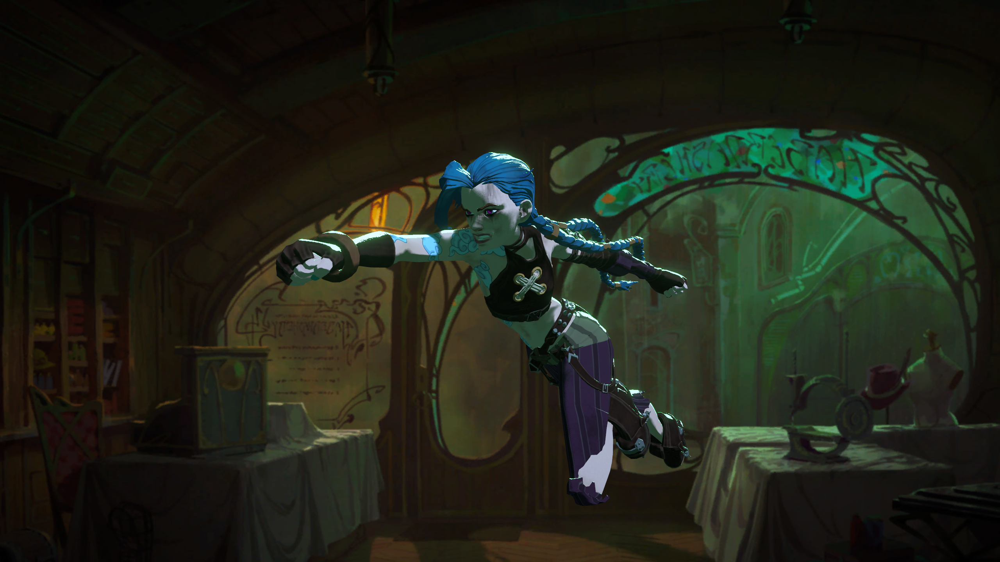
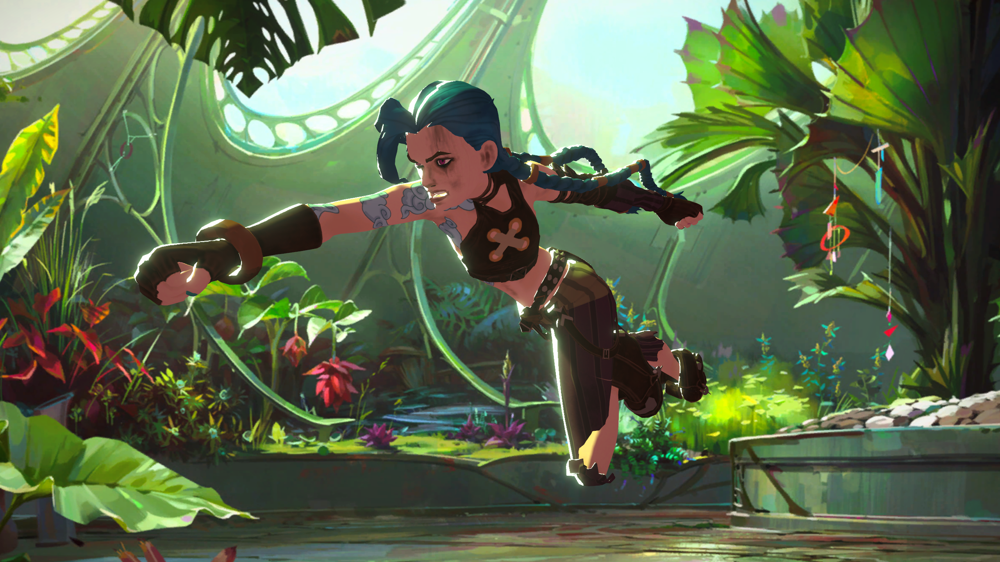

# Unity Arcane-inspired stylized character shader
A relatively simple shader that imitates the main shading techniques used in Arcane, though in realtime instead of in offline composition.

### How it works
It simulates the two main passes that Arcane and most other NPR shading styles use to drive the overall shading

1. **Lighting Pass**
    
    Luminance value of the main light - diffuse lighting combined with shadows sampled from the shadow mask. 

    This mask drives the color between the main texture color and it's color corrected shadow color variant

 

2. **Rim Lighting**

    Lighting value from a light behind the character, just lighting it's rim. It is calculated from on a light position that's offset from each pixel relative to the view direction by an offset parameter. 

The rim lighting mask then either overlays the Rim Color over the Lighting Pass color result or overrides it

 
 

  
  

### Limitations
Unity doesn't have area lights and I wanted to keep the shader independent from outside value updates, so the rim lighting is just based a singular offset from the view direction and using only a single color. Obviously more instances could be added in shader, but that bloats quickly. Also only the main light is supported, so no additional light sources.

The Arcane production uses hand placed gradient masks and other scene and frame specific artistic corrections which are obviously impossible to do in realtime gfx.

### How to use
Just plop the shader into your project files and create a material from it

All the pass masks can be stepped or kept as a gradient.

Basic color correction is part of the parametrization.

Normal mapping is available if you'd want to have sharper details in the lighting.

### Sources used
- The rig that I posed for the scene screenshots in this *README* was made for the Agora Community's monthly AnimChallenge and is not available for download anymore unfortunately, however there is a very nice free Jinx rig made by [XPea](https://animprops.com/product/jinx-character-rig-blender/)

- The background matte paintings are the following
    - [Zaun interior](https://www.artstation.com/artwork/zx6QWq) by *Naïm Bonnot*
    - [Greenhouse](https://www.artstation.com/artwork/x328aR) by *Charlotte O'Neill*
